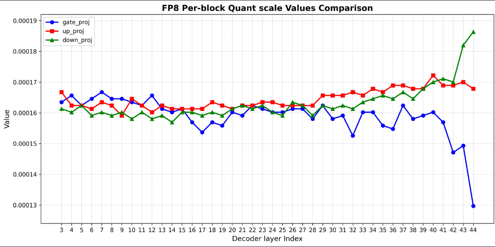

# 背景

目前大多数模型主推的量化权重仍然以是fp8为主要数据格式，关于per_block量化方式，常用的block_size为128*128，scale使用fp32 存储。

| 指标   | BF16 | FP16 | FP32 |
| :----- | :--- | :--- | :--- |
| 总位数 | 16   | 16   | 32   |
| 指数位 | 8    | 5    | 8    |
| 尾数位 | 7    | 10   | 23   |
|        |      |      |      |

# 误差来源分析
当将FP32值转换为UE8M0格式时，主要误差来源是剔除23位尾数位和符号位，这会导致：

1. 量化误差 ：FP32值被强制舍入到最近的2的整数次幂
2. 相对误差 ：误差与数值大小成正比（约50%的相对误差）
3. 绝对误差 ：随数值增大而增大
4. 无法处理负的scale （**scale会有负数值吗，感觉并不存在该场景？负值会直接颠覆原始权重的含义，不在是缩放场景**）


# 误差评估方法

### 1.理论误差分析 

### 相对误差分析

对于原始FP32值，转换为最近的2的整数次幂，最大相对误差不会超过50%

### 绝对误差分析

绝对误差随着幂次的提升而提升，最大绝对误差为 2的127次方


# step3-5-Flash fp8量化权重迁移到A5 mxfp8分析

官方提供的fp8量化权重只对路由专家做了量化，由于该模型有**42**层MOE，每层**288**个专家，每次只激活**8**个专家，只对moe部分量化可以达到非常好的压缩比，并且对精度影响极小。

##  0. 两种格式block划分区别
### mxfp8

weight_block: 32；msmodelslim需要将MOE拆解后完成量化，因此专家的dim可以先忽略
**gate_proj， up_proj**
Weight tensor Shape: [1280,  4096]
Weight tensor Dtype: F8_E4M3
Scale tensor Shape: [1280, 128]
Scale tensor Dtype: U8

**down_proj**
Weight tensor Shape: [4096, 1280]
Weight tensor Dtype: F8_E4M3
Scale tensor Shape: [4096, 40]
Scale tensor Dtype: U8


### fp8 per_block
weight_block: 128*128

**gate_proj， up_proj**
Weight tensor Shape: [288, 1280,  4096]
Weight tensor Dtype: F8_E4M3
Scale tensor Shape: [288, 10, 32]
Scale tensor Dtype: F32

**down_proj**
Weight tensor Shape: [288,  4096, 1280]
Weight tensor Dtype: F8_E4M3
Scale tensor Shape: [288,  32, 10]
Scale tensor Dtype: F32

### 如何进行block划分

#### fp8 perblock （当前llm主流的量化方案）

fp8量化常用 per_block方式, 包括glm5、Qwen3.5-397B、DeepSeekv3.2、MiniMax 2.5，下面使用2*2的 block 进行演示
```text
┌───────────────┬───────────────┐
│               │               │
│  Block [0,0]  │  Block [0,1]  │
│   scale: s₀   │   scale: s₁   │
│               │               │
├───────┬───────┼───────┬───────┤
│  w₀₀  │  w₀₁  │  w₀₂   │  w₀₃  │
├───────┼───────┼───────┼───────┤
│  w₁₀  │  w₁₁  │  w₁₂   │  w₁₃  │
├───────┴───────┼───────┴───────┤
│               │               │
│  Block [1,0]  │  Block [1,1]  │
│   scale: s₂   │   scale: s₃   │
│               │               │
├───────┬───────┼───────┬───────┤
│  w₂₀  │  w₂₁  │  w₂₂   │  w₂₃  │
├───────┼───────┼───────┼───────┤
│  w₃₀  │  w₃₁  │  w₃₂   │  w₃₃  │
└───────┴───────┴───────┴───────┘
```
#### mx format 
mxfp8 要求block为32，在msmodelslim中命名为per_block,  但是量化行为是per_group的方式。 假设我们有一个2*4的权重矩阵，block为2，下面是一个示例：
```text
┌───────────────┬───────────────┐
│  Block [0,0]  │  Block [0,1]  │
│   scale: s₀   │   scale: s₁   │
├───────┬───────┼───────┬───────┤
│  w₀₀  │  w₀₁  │  w₀₂   │  w₀₃  │
├───────┼───────┼───────┼───────┤
│  Block [1,0]  │  Block [1,1]  │
│   scale: s₂   │   scale: s₃   │
├───────┬───────┼───────┬───────┤
│  w₁₀  │  w₁₁  │  w₁₂   │  w₁₃  │
└───────┴───────┴───────┴───────┘
```


## 1. 查看fp8 per_block量化 每层scale的最小最大值，判断是否有负数值

min_sacle_list存储每层最小值；

(Pdb) max(min_scale_list)
0.00018637521
(Pdb) min(min_scale_list)
0.0001296997

max_scale_list存储每层的scale最大值

(Pdb) max(max_scale_list)
0.0042201453
(Pdb) min(max_scale_list)
0.0003073556

(Pdb) len(min_scale_list)
126
(Pdb) len(max_scale_list)
126

step3-5-flash中并没有负值 scale


## 2. fp8 scale值在不同decode layer走势图

绘制gate_proj、up_proj、down_proj在不同层的走势曲线



直接看scale的话，从第32层开始，波动开始变大，**后三层变化幅度尤其剧烈**

## 2. 官方量化权重反量化后和bf16比对

tensor直接比对分析是常见的手段，这里引入一个额外的视角进行分析：量化SNR（Signal-to-Noise Ratio，信噪比）值
$$\text{SNR}_{\text{dB}} = 10 \log_{10}\left(\frac{\sum x^2}{\sum e^2}\right) = 20 \log_{10}\left(\frac{\sqrt{\sum x^2}}{\sqrt{\sum e^2}}\right)$$ 

量化SNR是衡量 量化后信号质量 的核心指标，表示 原始信号功率与量化引入的噪声功率之比 ，单位为分贝(dB)。

### 核心含义
在FP8量化过程中，由于需要将高精度浮点数（如FP32）转换为低精度格式（如FP8），这个"取整"过程会引入 量化误差 ，这种误差在信号处理中被视为一种噪声源（称为 量化噪声 ），量化SNR就是衡量：

- 信号部分 ：原始高精度信号的功率
- 噪声部分 ：量化误差（量化噪声）的功率

### 物理意义解读
- SNR = 0 dB ：信号功率 = 噪声功率（质量极差）
- SNR = 20 dB ：信号功率是噪声的100倍（可用）
- SNR = 30 dB ：信号功率是噪声的1000倍（良好）
- SNR = 60 dB ：信号功率是噪声的1000000倍（极佳）


```shell
1. 加载原始权重...
成功加载文件: /data/models/Step-3.5-Flash/model-00009.safetensors
  model.layers.9.moe.down_proj.weight: shape=torch.Size([288, 4096, 1280]), dtype=torch.bfloat16
  model.layers.9.moe.gate_proj.weight: shape=torch.Size([288, 1280, 4096]), dtype=torch.bfloat16
  model.layers.9.moe.up_proj.weight: shape=torch.Size([288, 1280, 4096]), dtype=torch.bfloat16
原始权重shape: torch.Size([288, 1280, 4096])

2. 加载量化权重...
成功加载文件: /data/models/Step-3.5-Flash-FP8/model-00009.safetensors
  model.layers.9.moe.down_proj.weight_scale_inv: shape=torch.Size([288, 32, 10]), dtype=torch.float32
  model.layers.9.moe.gate_proj.weight_scale_inv: shape=torch.Size([288, 10, 32]), dtype=torch.float32
  model.layers.9.moe.up_proj.weight_scale_inv: shape=torch.Size([288, 10, 32]), dtype=torch.float32
  model.layers.9.moe.down_proj.weight: shape=torch.Size([288, 4096, 1280]), dtype=torch.float8_e4m3fn
  model.layers.9.moe.gate_proj.weight: shape=torch.Size([288, 1280, 4096]), dtype=torch.float8_e4m3fn
  model.layers.9.moe.up_proj.weight: shape=torch.Size([288, 1280, 4096]), dtype=torch.float8_e4m3fn
量化权重shape: torch.Size([288, 1280, 4096])
量化权重dtype: torch.float8_e4m3fn

3. 加载缩放因子...
成功加载文件: /data/models/Step-3.5-Flash-FP8/model-00009.safetensors
  model.layers.9.moe.down_proj.weight_scale_inv: shape=torch.Size([288, 32, 10]), dtype=torch.float32
  model.layers.9.moe.gate_proj.weight_scale_inv: shape=torch.Size([288, 10, 32]), dtype=torch.float32
  model.layers.9.moe.up_proj.weight_scale_inv: shape=torch.Size([288, 10, 32]), dtype=torch.float32
  model.layers.9.moe.down_proj.weight: shape=torch.Size([288, 4096, 1280]), dtype=torch.float8_e4m3fn
  model.layers.9.moe.gate_proj.weight: shape=torch.Size([288, 1280, 4096]), dtype=torch.float8_e4m3fn
  model.layers.9.moe.up_proj.weight: shape=torch.Size([288, 1280, 4096]), dtype=torch.float8_e4m3fn
加载的缩放因子shape: torch.Size([288, 10, 32])
加载的缩放因子dtype: torch.float32

4. 反量化并分析误差...

5. 验证形状...
原始权重shape: torch.Size([288, 1280, 4096])
期望的缩放因子shape: (288, 10, 32)
实际的缩放因子shape: torch.Size([288, 10, 32])
✓ 缩放因子形状正确

================================================================================
检查结果总结:
================================================================================
✓ 量化SNR: 30.47 dB
✓ 平均绝对误差: 0.000395
✓ 相对误差: 0.022461
✓ 路由专家top1最差余弦相似度: 0.992188
```

## 3. MXFP8量化权重  反量化后和BF16比对

```shell
================================================================================
开始FP8量化一致性检查
================================================================================

1. 加载原始权重...
成功加载文件: /data/models/Step-3.5-Flash/model-00009.safetensors
原始权重shape: torch.Size([288, 1280, 4096]), dtype: torch.bfloat16

2. 加载量化权重...
成功加载文件: /home/yejiajun/test/merge_weight/quant_model_weights-00043-of-00043.safetensors
量化权重shape: torch.Size([288, 1280, 4096]), dtype: torch.float8_e4m3fn

3. 加载缩放因子...
成功加载文件: /home/yejiajun/test/merge_weight/quant_model_weights-00043-of-00043.safetensors
加载的缩放因子shape: torch.Size([288, 1280, 128]), dtype: torch.uint8

4. 反量化并分析误差...

5. 验证形状...
原始权重shape: torch.Size([288, 1280, 4096])
期望的缩放因子shape: (288, 1280, 128)
实际的缩放因子shape: torch.Size([288, 1280, 128])
✓ 缩放因子形状正确

================================================================================
检查结果总结:
================================================================================
✓ 量化SNR: 29.06 dB
✓ 平均绝对误差: 0.000412
✓ 相对误差: 0.022827
✓ 路由专家top1最差余弦相似度: 0.992188
```


