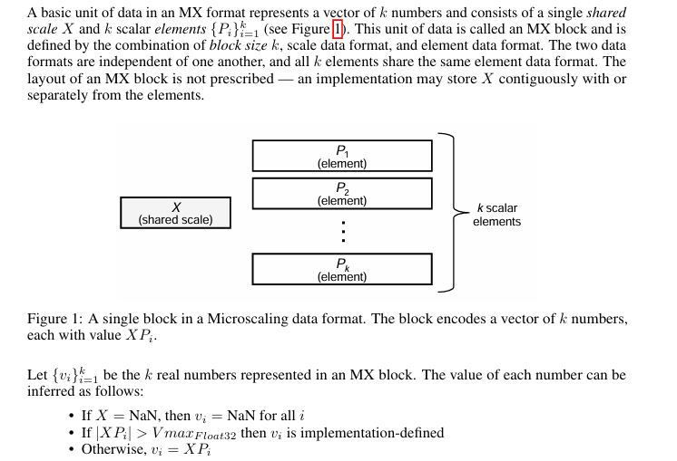
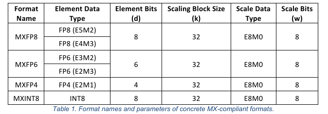

# MicroScaling Data Formats

## 1. MicroScaling(MX)

- MX 格式中的基本数据单元由 `k` 个数字组成的向量，并由一个共享的Scale `X` 组成

- 数据单元和Scale值的两种数据格式彼此独立，所有 `k` 个元素共享相同的元素数据格式

- MX 块的布局没有规定： 实现可以将 `X` 与元素连续存储，也可以分开存储，查看了step3-5和minimax存储方式，保存为safetensor的时候，采用的是分开存储方案（weight和scale维护不同的map key）。

  

方案A: Scale与元素交错存储
┌──────────┐──────────┐──────────┐
│  Scale                 │ Element0         │ Element1          │ ...
└──────────┴──────────┴──────────┘

方案B: Scale与元素分开存储
┌──────────┐──────────┐
│  All                     │ Elements          │
│  Scales               │                           │
└──────────┴──────────┘

## 2. MX format

- 命名采用MX + element数据类型，例如 element元素的数据类型为int8，那么命名为MXINT8
- block_size 统一使用32，可能和硬件/DeepLearning中的设计有关
- 存储有两种方案：

方案A: Scale与元素交错存储
┌──────────┐──────────┐──────────┐
│  Scale                 │ Element0         │ Element1          │ ...
└──────────┴──────────┴──────────┘

方案B: Scale与元素分开存储
┌──────────┐──────────┐
│  All                     │ Elements          │
│  Scales               │                           │
└──────────┴──────────┘

目前来看，对于FP8 per_block量化，方案B是当前业界更倾向的方式；

msmodelslim处理后的mxfp8权重， 也会将scale和elements分开进行存储。  **框架侧在加载模型的时候，可能会编排成方案A的格式**，因为硬件可以直接处理mxfp8格式的数据，不需要软件干预。

## 2.1 element 数据类型

### 2.1.1 fp8

|                   | **E4M3**                          | **E5M2**                              |
| :---------------- | :-------------------------------- | :------------------------------------ |
| **Exponent bias** | 7                                 | 15                                    |
| **Infinities**    | N/A                               | S 11111 00₂                           |
| **NaN**           | S 1111 111₂                       | S 11111 {01, 10, 11}₂                 |
| **Zeros**         | S 0000 000₂                       | S 00000 00₂                           |
| **Max normal**    | S 1111 110₂ = ± 2⁸ × 1.75 = ± 448 | S 11110 11₂ = ± 2¹⁵ × 1.75 = ± 57,344 |
| **Min normal**    | S 0001 000₂ = ± 2⁻⁶               | S 00001 00₂ = ± 2⁻¹⁴                  |
| **Max subnorm**   | S 0000 111₂ = ± 2⁻⁶ × 0.875       | S 00000 11₂ = ± 2⁻¹⁴ × 0.75           |
| **Min subnorm**   | S 0000 001₂ = ± 2⁻⁹               | S 00000 01₂ = ± 2⁻¹⁶                  |

### 2.1.2 fp4

|                   | E2M1                                    |
| :---------------- | :-------------------------------------- |
| **Exponent bias** | 1                                       |
| **Infinities**    | N/A                                     |
| **NaN**           | N/A                                     |
| **Zeros**         | S 00 0₂                               |
| **Max normal**    | S 11 $1_2 = \pm 2^2 \times 1.5 = \pm 6.0$ |
| **Min normal**    | S 01 $0_2= \pm 2^0 \times 1.0 = \pm 1.0$ |
| **Max subnorm**   | S 00 $1_2= \pm 2^0 \times 0.5 = \pm 0.5$ |
| **Min subnorm**   | S 00 $1_2= \pm 2^0 \times 0.5 = \pm 0.5$ |

### 2.1.3 其他类型

[ocp-microscaling-formats-mx-v1-0-spec-final-pdf](https://www.opencompute.org/documents/ocp-microscaling-formats-mx-v1-0-spec-final-pdf)

ocp规范中可以自行查询

## 2.2 Scale 数据类型

|                          | E8M0        |
| :----------------------- | :---------- |
| Exponent bias            | 127         |
| Supported exponent range | -127 to 127 |
| Infinities               | N/A         |
| NaN                      | 11111111₂   |
| Zeros                    | N/A         |

###  2.5特殊值处理

MX格式通过两种方式编码`NaN`：
第一：如果`X`是`NaN`，则MX块中的所有element值都是`NaN`，无论编码方式如何
第二：如果X不是`NaN`，每个元素Pi可以单独编码`NaN`。根据元素格式，MX格式可以通过让`X`为一个数字（即不是`NaN`）且每个Pi单独编码Inf来编码Inf。共享的标度`X`不编码Inf

# 3. 浮点权重-> MX format

**Require:** $emax_{elem} = \text{exponent of the largest normal number in the element data format}$

1. $shared\_exp \leftarrow \lfloor \log_2(\max_i(|V_i|)) \rfloor - emax_{elem}$
2. $X \leftarrow 2^{shared\_exp}$
3. **for** $i = 1$ **to** $k$ **do**
4. &nbsp;&nbsp;&nbsp;&nbsp; $P_i = \text{quantize\_to\_element\_format}(V_i/X)$, clamping normal numbers
5. **end for**
6. **return** $X, \{P_i\}_{i=1}^k$

在第1行，shared_exp 包含 emax_elem 的偏移量，以将最大输入指数映射到元素数据格式中的最大二进制指数。这使得元素数据格式的指数范围得以充分利用。

在第4行，当对 Vi/X 进行量化时，超过元素格式可表示范围的正常数会被夹紧到可表示的最大值，同时保留符号。Inf 和 NaN 不会被夹紧。

在第4行，如果对应的输入 Vi 是次正规 Float32 数，则 Pi 被设置为零。该操作在 OCP MX 规范中未描述，这是为了简化算法而进行的。

在转换多维张量时，必须为共享比例选择一个主轴（通常是矩阵乘法中的汇约维度）。对于二维矩阵，比例可以在每行或每列的 k 个元素中共享。在 MX 格式下转置二维矩阵会改变共享比例的轴——即转换为 MX 格式和转置不是交换律操作。

参考：https://arxiv.org/pdf/2310.10537

# 3. 华为体系

HiFP8

https://mp.weixin.qq.com/s/dHKzxIiix9zZKVVyJrW8_Q

# reference

1. https://arxiv.org/pdf/2310.10537
2. https://www.opencompute.org/documents/ocp-microscaling-formats-mx-v1-0-spec-final-pdf
3. https://adg.csdn.net/69524bbd5b9f5f31781b6a33.html
4. https://github.com/microsoft/microxcaling?spm=a2ty_o01.29997173.0.0.69525171V0EEIn
5. 